# TVault (Trust Vault)

TVault is a cross-platform desktop application for creating secure encrypted vaults. A vault is essentially an encrypted folder (or container) that you can lock and unlock on demand to protect your sensitive files. When locked, all data inside the vault is encrypted and inaccessible. When unlocked, the vault behaves like a normal folder on your system, allowing you to add, remove, or edit files easily. TVault is designed with a focus on strong security, privacy, and ease of use on Windows and macOS.

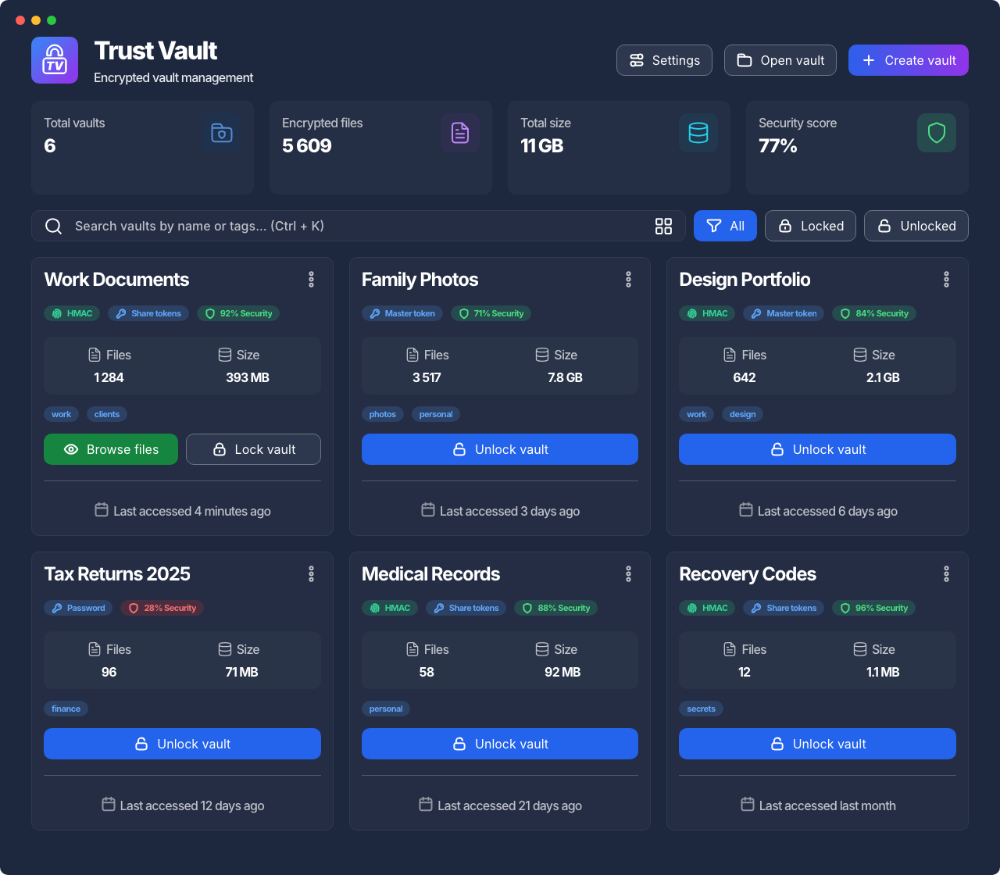

Every vault you own sits on one screen. Each card tells you how many files the vault holds, how much space it takes, how it is unlocked, and how strong that protection is — so you can see the state of your data without unlocking anything.

## Features

- **Secure Storage:** Protect your files with AES-256 encryption – a strong, industry-standard cipher. You can choose one of several methods to secure your vault’s encryption key:

    - **Password:** Use a password or passphrase you create.
    - **Master Key:** Let the app generate a random master key for you.
    - **Shamir’s Secret Sharing:** Split the vault’s master key into multiple parts using [Shamir’s Secret Sharing (SSS)](https://en.wikipedia.org/wiki/Shamir%27s_secret_sharing). This method allows you to require N out of M key “shares” to unlock the vault – adding an extra layer of security for collaborative or distributed scenarios.

    Additionally, TVault employs an HMAC-based integrity check on the vault data. This means any unauthorized modification of the encrypted vault file can be detected, ensuring that your data hasn’t been tampered with.

- **A Dashboard for Your Vaults:** Your vaults are listed as cards showing their file count, size, tags and unlock method. Search by name or tag, filter by locked and unlocked, and see the totals across every vault at the top. Point TVault at the folders where you keep your containers and it finds them on startup, so a vault is never “lost” after you reinstall or move to another machine.

- **Security Score:** Every vault carries a score, computed by the core from the way the vault was built – key type, integrity verification, compression. It is shown on the card and colour-coded (red, amber, green), so a vault behind a lone password stands out from one split into Shamir shares with HMAC integrity.

- **Unlock with Touch ID (macOS):** Save a vault’s key to the macOS Keychain when you create it, and reopen the vault with Touch ID or your Mac login password instead of typing its password, master token or Shamir shares. If the vault uses HMAC integrity verification, its integrity password is saved alongside the key, so a single prompt opens the vault completely. It is entirely opt-in, and the option is hidden on other platforms.

- **Cross-Platform Desktop App:** TVault runs natively on Windows and macOS, with a consistent user interface across both. The app is built with a lightweight stack (powered by Tauri) that integrates with your operating system’s native webview. This results in a small bundle size and minimal resource usage, while still providing a modern, responsive UI. It follows your system’s light or dark theme, speaks English and Russian, and its animations can be switched off entirely.

- **Open Source & Privacy-Focused:** The source code is available for review, and the application is local-first. All vault data is stored locally on your machine – TVault does not upload or sync your files to any cloud service. Your secrets stay with you. (See [License](https://github.com/namelesscorp/TVault/blob/master/LICENSE) for details on the source-available license.) The project welcomes community contributions and operates with transparency in mind.

## Installation

TVault is available for both Windows and macOS:

- **Windows:** Download the latest Windows installer (.exe) from our releases and run it. The installer will guide you through setup. Note: TVault for Windows requires the Microsoft Edge WebView2 runtime (used by the Tauri framework). On Windows 11 (and most up-to-date Windows 10 systems), WebView2 is already installed. If your system doesn’t have it, the TVault installer will automatically download and install WebView2 for you. No additional setup is needed — just follow the prompts.

- **macOS:** Download the latest macOS app (.dmg) from our releases. Open the downloaded file and drag TVault into your Applications folder.

> **Upgrading from a 0.1.x beta:** the container format changed in 1.0.0, and vaults created by a beta cannot be opened by it. Unlock them with the older build, copy the files out, and create the vaults again in 1.0.0. See the [changelog](CHANGELOG.md).

## Usage

TVault follows a simple flow: **Create** → **Unlock** → **Work with files** → **Reseal/Close**. A vault is just an encrypted container that, when unlocked, is exposed as a normal folder in your system’s temporary directory. You work with your files using the OS file manager; the app itself doesn’t edit files.

### Create a vault

1. **Vault information.** Give the vault a name, and optionally a comment and tags — tags are what you will search by later.

    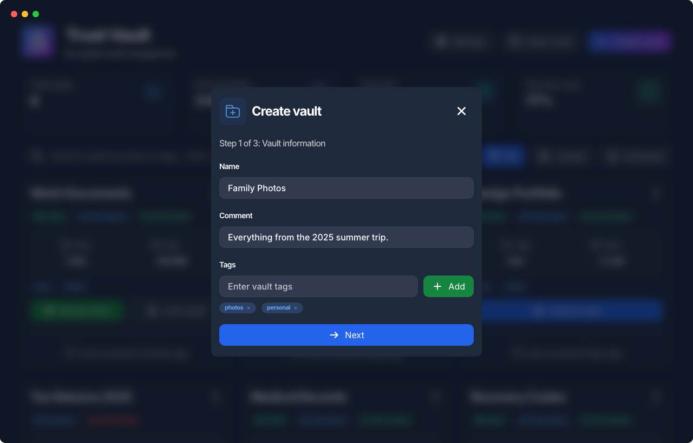

2. **Folders.** Choose the folder whose files go into the vault, and where the encrypted container file itself is written. If a container already sits at that path, TVault refuses to overwrite it.

3. **Security settings.** Decide how the vault is unlocked, and whether its integrity is verified.

    - **Password** — unlock with a password or passphrase.
    - **Master token** — unlock with a generated 256-bit master key.
    - **Shamir’s Secret Sharing** — split the master key into M shares and require N of them to unlock, so no single share (and no single person) can open the vault alone.
    - **HMAC integrity verification** — detects any unauthorized modification of the encrypted container. It is protected by a password of its own.

    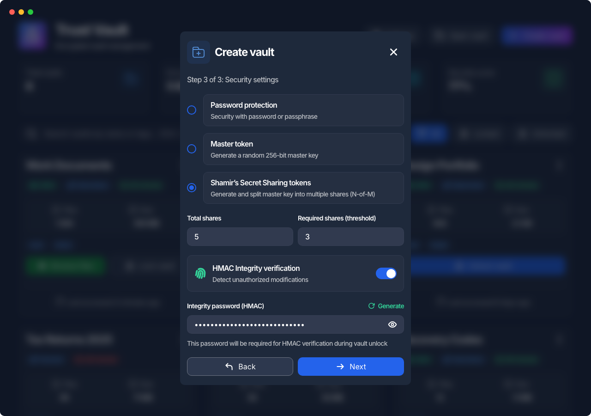

4. **Save to Keychain (macOS).** Optionally save the vault’s key to the macOS Keychain so you can reopen the vault with Touch ID or your Mac login password instead of typing credentials. It covers every unlock method — password, master token and Shamir shares — and, for a vault with HMAC integrity verification, its integrity password is saved alongside the key, so a single Touch ID prompt opens the vault completely. This step is opt-in and macOS-only; skip it to keep entering credentials by hand.

    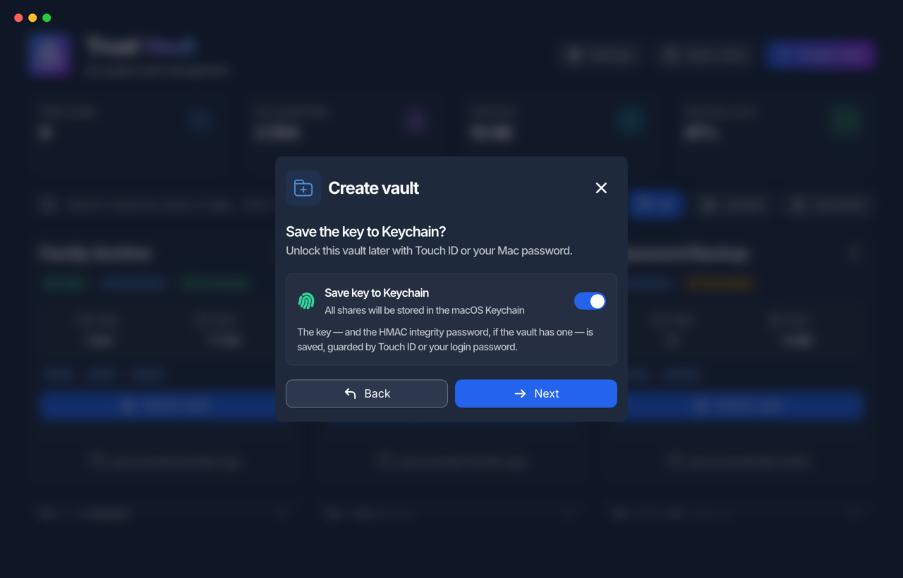

5. **Finish.** The container is created at the chosen location, with real progress reported while your files are packed and encrypted. If the vault uses a master token or Shamir shares, **this is the only time they are shown** — copy or save them now, they cannot be recovered later.

### Open a vault that is not on the dashboard

A container that TVault has never seen — one you copied from another machine, or that lives outside your scanned folders — is opened with **Open vault** in the header. Point it at the `*.tvlt` file and either add it to the dashboard for later, or unlock it straight away.

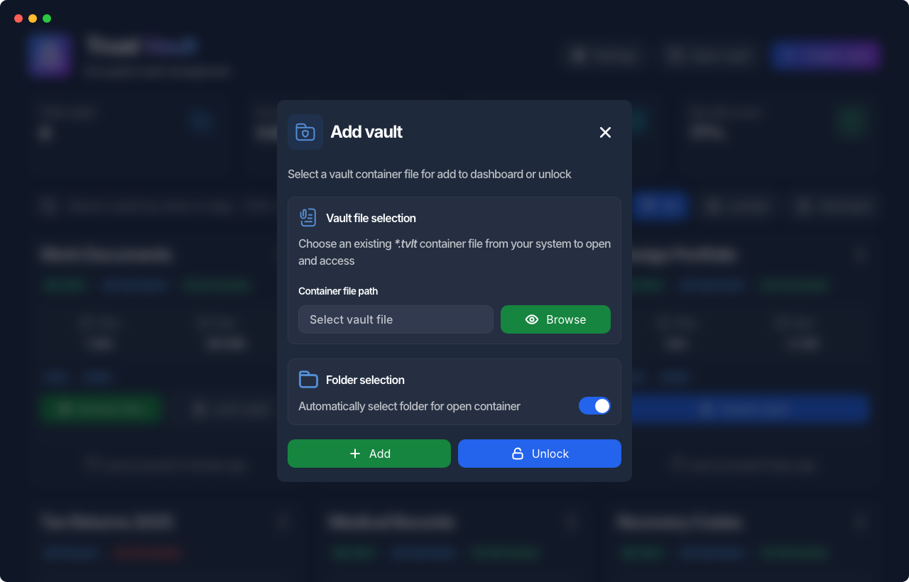

### Unlock a vault

Press **Unlock vault** on the card. TVault asks only for what that vault actually needs: a password, a master token, or the required number of Shamir shares — plus the HMAC password, if integrity verification is enabled.

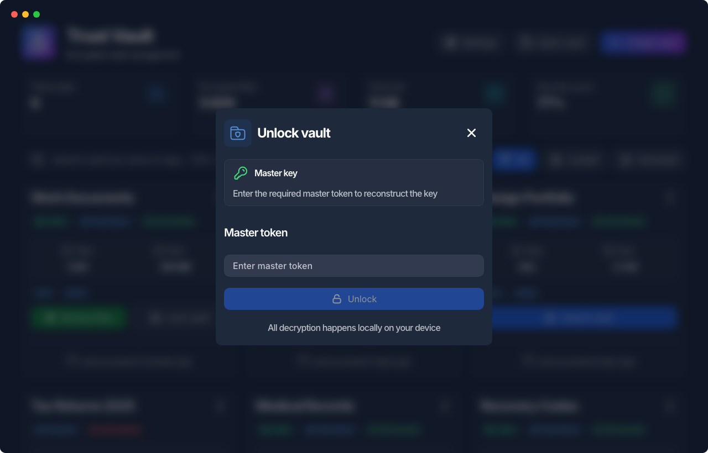

If you saved the vault’s key to the Keychain when you created it, an **Unlock with Touch ID** button appears above the fields: authenticate with Touch ID or your Mac login password and the vault opens without typing anything. Cancel it to fall back to entering the key by hand. (macOS only.)

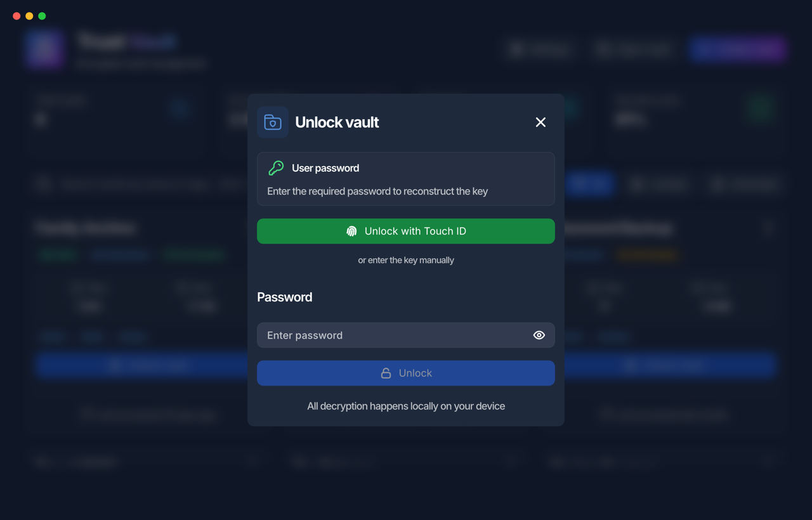

On success, TVault decrypts the container into a temporary OS folder (inside your system’s temp directory). This is the folder you’ll work in.

### Work with files

- Press **Browse files** on the card to open the unlocked folder in your file manager.
- Treat it like any normal directory: **add, edit, and delete** files using your usual apps.
- The app does not embed an editor; all changes happen in the unlocked folder.
- You can also edit vault metadata (name, tags, comment) from the app UI while the vault is unlocked.

### Reseal / Close

- When you’re done, press **Lock vault** on the card.
- TVault encrypts all changes back into the container, updates the HMAC, and deletes the temporary folder in the OS temp directory.

### Vault information

Any vault, locked or unlocked, can be inspected from the card’s menu: key type, integrity, compression, sizes, security score, and where its container lives.

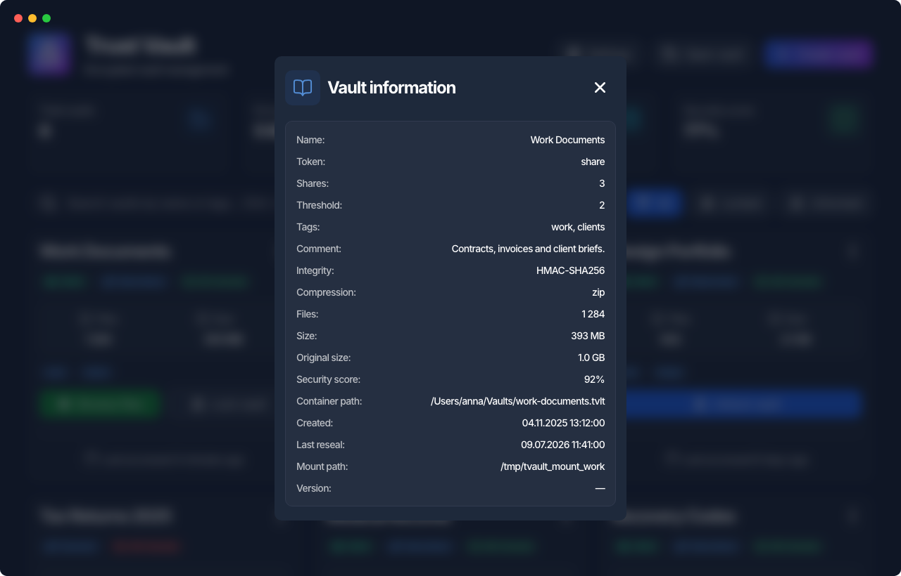

### Important

- While a vault is unlocked, its contents exist in the OS temp directory — treat the session as sensitive (lock when you step away).
- No recovery: if you lose the required credentials (password, master key, or Shamir shares), the vault cannot be recovered. Back up keys/shares securely.

## Settings

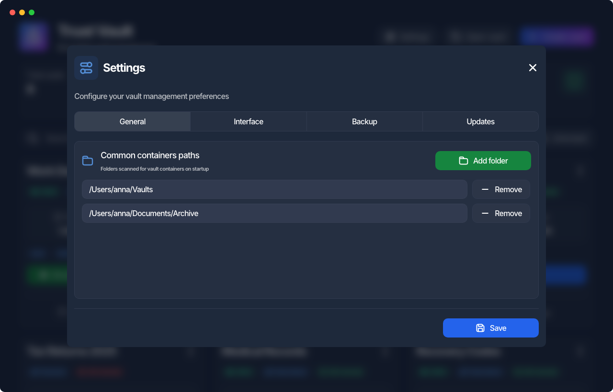

- **General** — the folders TVault scans for containers on startup. Add the places where you keep your vaults and they show up on the dashboard by themselves.
- **Interface** — theme, language, and a switch that turns off every animation in the app.
- **Backup** — export your settings to a JSON file and import them back on another machine. The file carries your preferences, scanned folders and the list of vaults; **it never contains passwords, master tokens or Shamir shares**.
- **Updates** — automatic updates and a manual check.

### Themes

TVault follows your system theme, and can be pinned to light or dark in Settings › Interface.

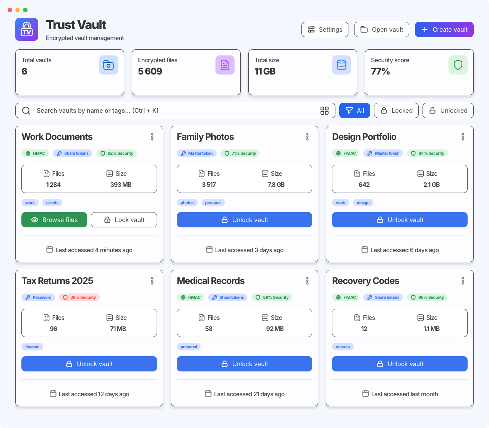

### Updates

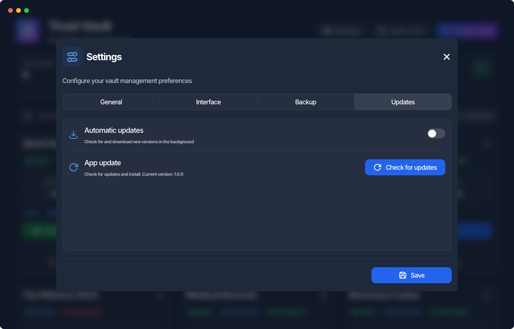

Automatic updates are **off by default** — until you turn them on, the app never reaches the network on its own. Once enabled, TVault checks for a new release in the background, downloads it, and then offers to restart.

Installing an update means restarting the app, so TVault never does it behind your back. The restart is always your decision, and it is refused while a vault is still unlocked: pulling the app out from under a mounted vault would strand its temporary folder and lose whatever had not been sealed back yet. Lock your vaults first, then restart.

## Build

### Prerequisites

Before running this project, make sure you have the following installed:

- **Node.js** (v18 or higher)
- **Yarn** package manager
- **Rust** (latest stable version)
- **Tauri CLI**: `cargo install tauri-cli`

#### Installing Rust

If you don't have Rust installed, follow the official installation guide:

```bash
curl --proto '=https' --tlsv1.2 -sSf https://sh.rustup.rs | sh
```

#### Installing Tauri CLI

```bash
cargo install tauri-cli
```

### Getting Started

1. **Clone the repository**

    ```bash
    git clone https://github.com/namelesscorp/tvault.git
    cd tvault
    ```

2. **Install dependencies**

    ```bash
    yarn install
    ```

3. **Run the development server**
    ```bash
    yarn tauri:dev
    ```

This will start both the frontend development server and the Tauri application.

### Project layout

- `src/` — the React frontend, grouped by feature (`Dashboard`, `Modal`, `Vault`, `Settings`, …).
- `src-tauri/` — the Rust side: window setup, filesystem commands, and the bridge to the vault core.
- `src-tauri/binaries/` — the [tvault-core](https://github.com/namelesscorp/tvault-core) CLI, shipped with the app as a sidecar. All encryption and decryption happens there; the app itself implements no cryptography.
- `docs/screenshots/` — the images used by this README.

### Available Scripts

#### Development

- `yarn dev` — Start Vite development server only
- `yarn tauri:dev` — Start Tauri development mode (recommended)
- `yarn preview` — Start Vite preview server

#### Build

- `yarn build` — Build for development
- `yarn build:dev` — Build Vite in development mode
- `yarn build:prod` — Build Vite in production mode
- `yarn tauri:build` — Build Tauri app

#### Cross-platform Build

- `yarn build:all` — Build for all platforms (macOS ARM, macOS Intel, Windows 32-bit, Windows 64-bit)
- `yarn build:mac-arm` — Build for macOS ARM (Apple Silicon)
- `yarn build:mac-intel` — Build for macOS Intel
- `yarn build:win-32` — Build for Windows 32-bit
- `yarn build:win-64` — Build for Windows 64-bit
- `yarn build:mac` — Build for both macOS architectures
- `yarn build:win` — Build for both Windows architectures

#### Code Quality

- `yarn format` — Format code with Prettier and fix ESLint errors
- `yarn lint:eslint` — Run ESLint

## Command-Line Interface (CLI)

For advanced users and automation scenarios, TVault also offers a Command-Line Interface (CLI) tool. The CLI provides the core functionality of TVault through terminal commands, which is useful for scripting and integrating into your workflow. Some capabilities of the CLI include:

- Vault Creation: You can create new vaults via CLI commands, specifying options such as vault name, location, and key type (password, master key, or Shamir shares). This is handy if you want to automate vault setup or incorporate TVault into installation scripts for new machines.

- Unlocking and Locking: The CLI lets you unlock (unseal) and lock (reseal) vaults from the command line. For example, you could write a script to automatically unlock a vault, run a backup or access a file, and then lock it again. The CLI accepts the required credentials (password, key, or shares) as arguments, so it can be used non-interactively in automation scenarios.

- Retrieving Data: While the vault is unlocked via CLI, you can interact with the vault’s files using normal shell commands. This enables scenarios like scheduled tasks that extract or update information in a vault without manual intervention.

- Backup and Scripting: You can script backups for safekeeping using the CLI. For instance, a cron job could use TVault CLI to unlock a vault, run a backup (copy the vault file to a backup location), and then lock it again. Or you might script the export of certain data. Essentially, anything you can do in the GUI can be done via the CLI, allowing integration with other tools (CI/CD pipelines, etc.) and workflows.

The desktop app is a front end for this very CLI — it ships the core as a sidecar binary and re-implements none of the cryptography itself. The CLI therefore shares the same security model as the GUI: all encryption/decryption is done locally and the same precautions apply. Please read the [CLI documentation](https://github.com/namelesscorp/tvault-core) for detailed command usage and examples.

## Changelog

Notable changes are recorded in the [changelog](CHANGELOG.md).

## Contributing

Contributions are welcome! If you encounter any bugs or have ideas for improvements, feel free to open an issue or submit a pull request. We appreciate the community’s help in making TVault better:

- **Report Issues:** Use the GitHub Issues to report bugs or request features. Please include details and steps to reproduce for bugs.
- **Pull Requests:** If you want to contribute code or documentation, fork the repository and create a pull request. Ensure your changes build properly and discuss major changes in an issue first if possible. All contributions will be reviewed.

## License

TVault Core is proprietary software.
Use of this code is governed by the [License](https://github.com/namelesscorp/TVault/blob/master/LICENSE) agreement.

## Contact

If you have questions or issues, please create an Issue in the repository or contact the development team.

- [tvault.app](https://tvault.app)
- support@tvault.app

---

© 2026 Trust Vault. All rights reserved.
